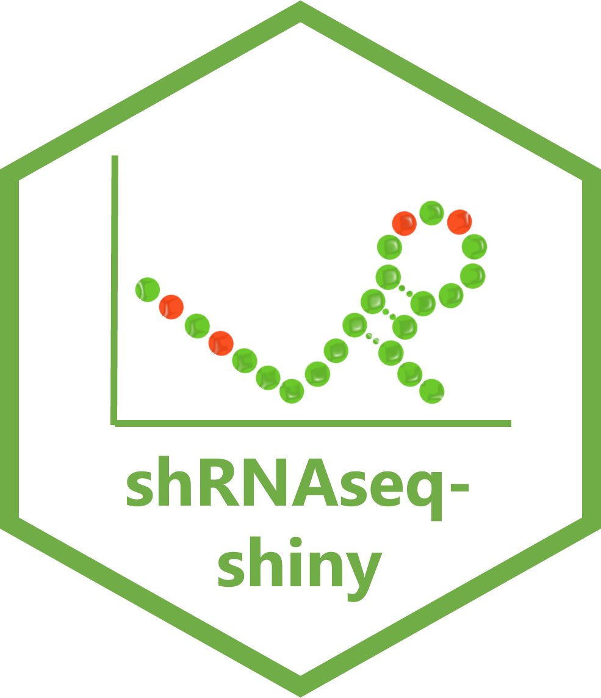
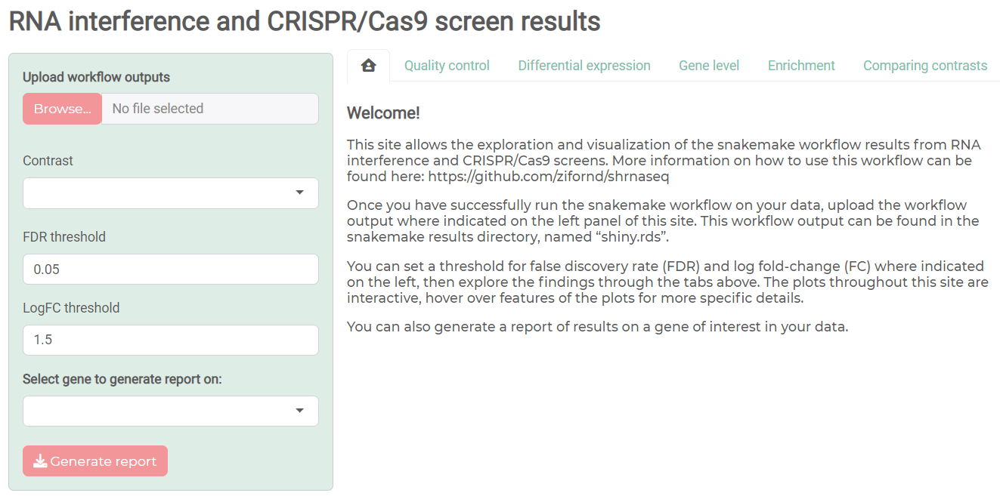

# shrnaseq-shiny 

[](https://community.rstudio.com/new-topic?category=shiny&tags=shiny)
[](https://github.com/tterb/atomic-design-ui/blob/master/LICENSEs)

## Table of Contents

* [Overview](#overview)
* [Usage](#usage)
* [Contributing](#contributing)
* [Authors](#authors)
* [Acknowledgements](#acknowledgements)
* [License](#license)

## Overview

This repository houses a Shiny app to visualise and explore the output of the shRNAseq workflow of shRNA-seq and CRISPR-Cas9 genetic screen analysis. Before lauching this app you will need to run the workflow on your data. Details on how to run the shrnaseq workflow on your shRNA-seq or CRISPR-Cas9 genetic screening data can be found [here](https://github.com/zifornd/shrnaseq/). The shiny app homepage is shown below:



## Usage

The easiest way to run this application is to install the shiny package in RStudio and use the `runGitHub` function as below.

```R
library(shiny)
shiny::runGitHub('shrnaseq-shiny', 'zifornd')
```

Alternatively you can clone the git repository, 

```bash 
git clone https://github.com/zifornd/shrnaseq-shiny
```
then use the `runApp()` function in RStudio as below.

```R
library(shiny)
setwd("~/shrnaseq-shiny")
runApp()
```

Once the application is loaded, upload the `shiny.rds` file found in `results` directory of your successfully run shrnaseq workflow. 

## Contributing

See [CONTRIBUTING.md](CONTRIBUTING.md) for ways to get started.

Please adhere to this project's [code of conduct](CODE_OF_CONDUCT.md).

## Authors

- [Claire Prince](https://github.com/prince-claire)
- [James Ashmore](https://github.com/jma1991)

## Acknowledgements

For more information about Shiny from RStudio, see [here](https://shiny.rstudio.com/). 

### CRAN
- rlang
- shiny
- DT
- ggplot2
- RColorBrewer
- heatmaply
- plotly
- reshape
- tidyverse
- bslib
- scales
- ggrepel

### Bioconductor
- limma
- edgeR

## License

This workflow is licensed under the [MIT](LICENSE.md) license.  
Copyright &copy; 2022, Zifo RnD Solutions